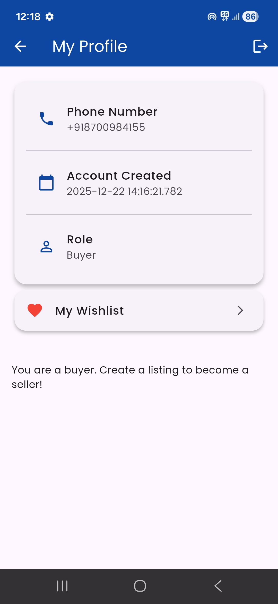
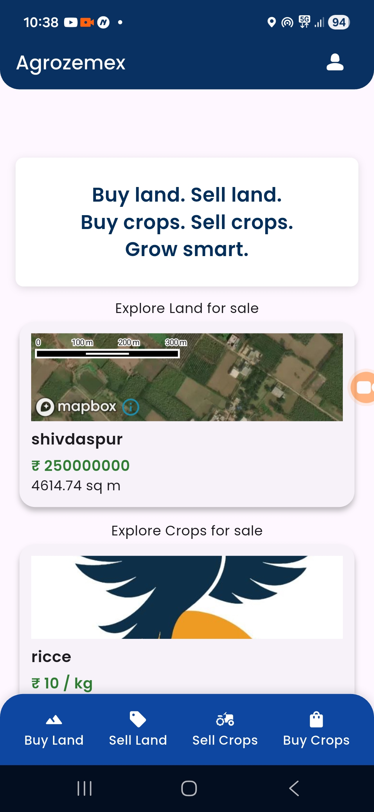
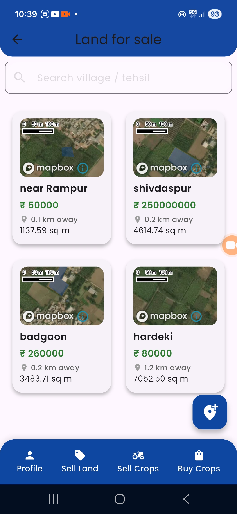
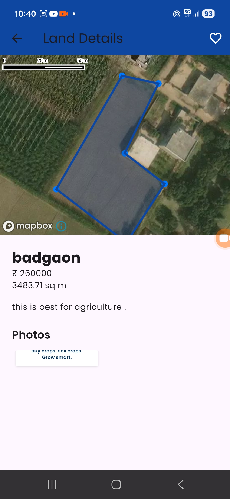
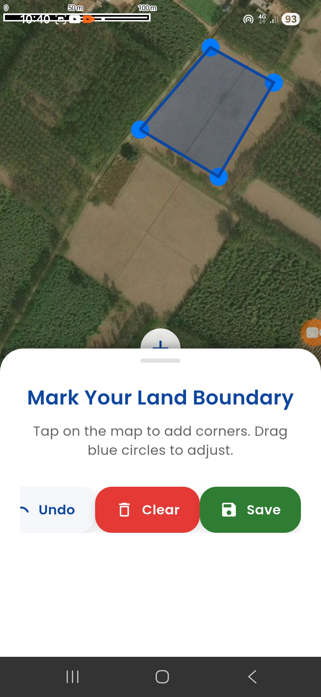
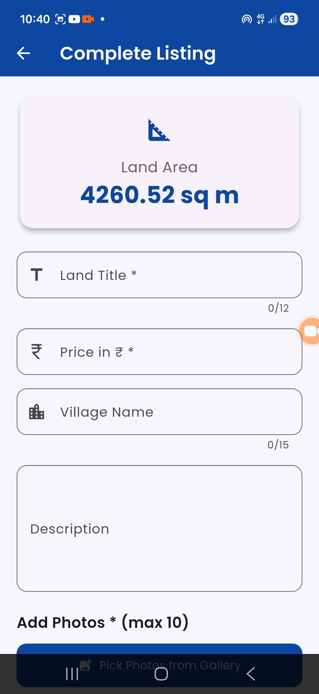
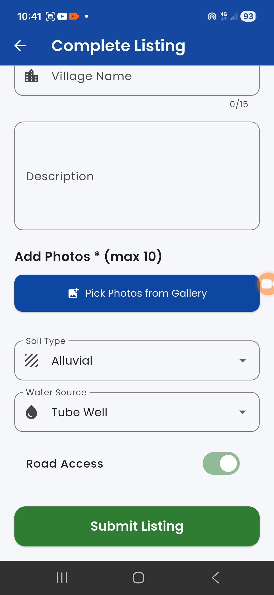
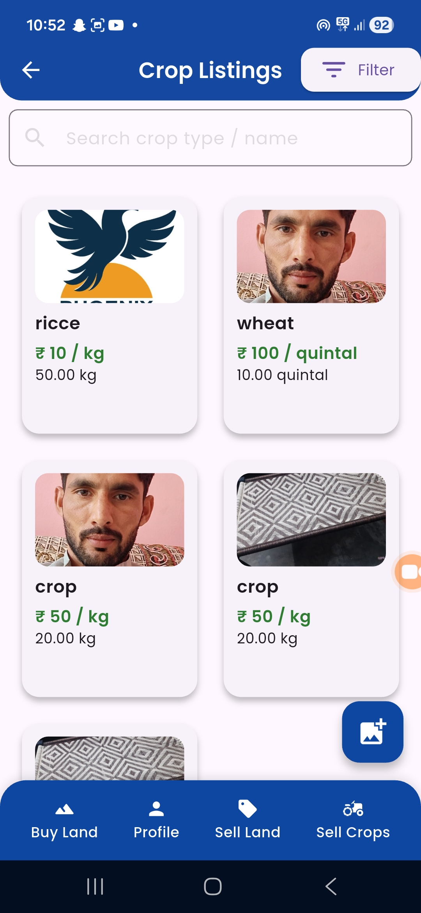
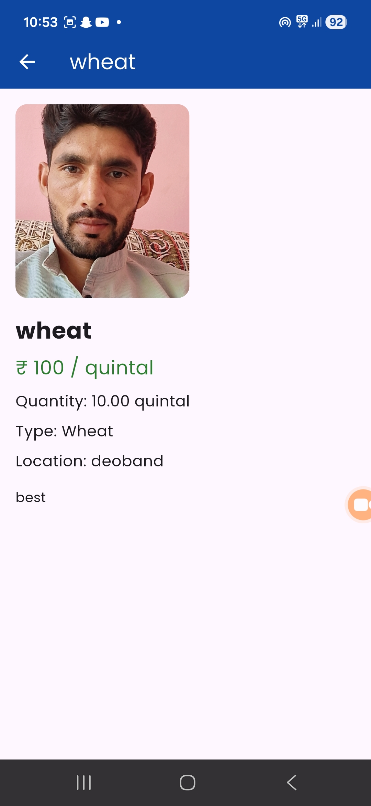
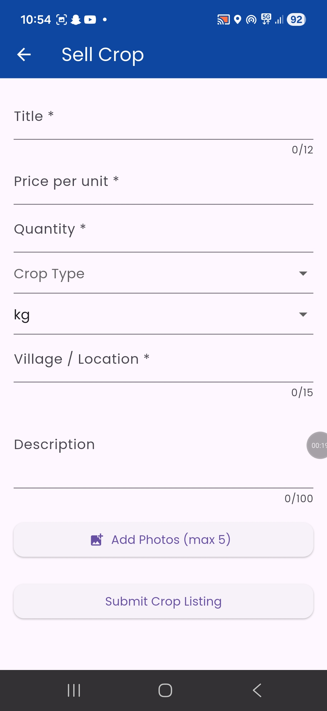

# 🌾 Agrozemex — Land & Crop Marketplace Platform

## 👨‍💻 Developer Profile

**Name:** Kosen Aalam  
**Role:** Full Stack Mobile & Backend Developer  
**GitHub:** https://github.com/Kosenaalam/agrozemex  
**LinkedIn:** https://linkedin.com/in/kosen  
**Email:** [Kosenaalam@gmail.com](mailto:Kosenaalam@gmail.com)  

---

## ✨ Screenshots of App

<div align="center">

<!-- Add your screenshots here after creating the screenshots folder -->













</div>

---

## 🚀 Overview

Agrozemex is a **production-grade mobile marketplace** designed for buying and selling agricultural land and crops.  

It combines **geo-intelligent land discovery** with a high-performance **crop trading platform**, built with strong focus on scalability, performance optimization, and real-world usability.

---

## 🎯 Problem Statement

Traditional agricultural marketplaces suffer from:

* Poor land discovery and visualization
* Inefficient crop trading systems
* Lack of advanced search and filtering
* Poor performance with large datasets
* Bad user experience on mobile

---

## 💡 Solution

Agrozemex provides a complete digital solution:

* Interactive Mapbox-powered land marketplace
* Image-rich crop trading platform
* Advanced token-based search and intelligent ranking
* Highly optimized backend for fast browsing and filtering
* Scalable architecture capable of handling large user base

---

## 🔐 Authentication & Security

* Secure Phone OTP login using **Firebase Authentication**
* User-based data isolation
* Firestore Security Rules
* Session management and input validation

---

## ⚙️ Core Features

### 🌍 Land Marketplace (Geo-Based)
* Interactive land listings with Mapbox integration
* GPS boundary polygon creation
* Mini-map previews with caching
* Distance-based sorting from user location
* Grid-based map clustering for performance

### 🌾 Crop Marketplace
* Beautiful image-driven crop listings
* Price per unit (kg/quintal/ton)
* Quantity-based selling system
* Clean and fast card-based UI

### 🔍 Advanced Search & Filtering
* Token-based keyword indexing (`search_tokens`)
* Advanced filters (soil type, water source, road access, area range)
* Debounced search with optimized queries
* Calculate the Land area

---

## 🧠 Engineering Highlights

* Implemented **token-based search system** to overcome Firestore limitations
* Built custom ranking algorithm for better search relevance
* Optimized Mapbox rendering using widget caching and reduced re-renders
* Designed grid-based clustering algorithm for scalable map visualization
* Implemented efficient Firestore pagination and query optimization
* Eliminated duplicate rendering and lifecycle bugs
* Designed system capable of handling high concurrent users and large datasets

---

## 🏗️ System Architecture

```text
Flutter App (Client)
        ↓
Firebase (Auth + Firestore)
        ↓
Optimized Query Layer + Indexing
        ↓
Token-based Search + Caching

🛠️ Tech Stack
Frontend

Flutter (Material 3)

Backend

Firebase Authentication
Cloud Firestore

Services

Mapbox (Maps & Polygon Rendering)
Geolocator (User Location)

Architecture & Tools

Clean Architecture
Provider / Riverpod
Pagination & Caching Strategies


📊 Scalability
Agrozemex is designed for high scalability:

MetricCapacityListingsMillions of recordsUsers (current)10K–50KWith proper scaling1M+ users
Key optimizations:

Token-based indexing
Efficient pagination
Map widget caching
Optimized Firestore queries


🌍 Vision
To build a globally scalable agricultural marketplace that brings transparency, efficiency, and better market access to farmers and agribusinesses.

📦 Future Enhancements
 seller dashboard
Payment integration
Push notifications
Recommendation engine
Admin moderation panel
Multi-language support


⭐ Final Statement
Agrozemex is a real-world production system, built with scalable architecture and deep performance optimization, capable of supporting 1 million+ users with proper infrastructure scaling.

Built  for Indian farmers and agribusinesses