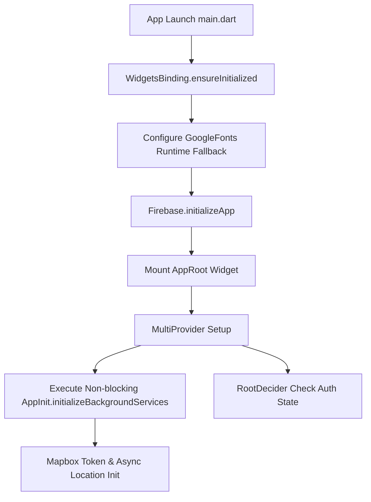
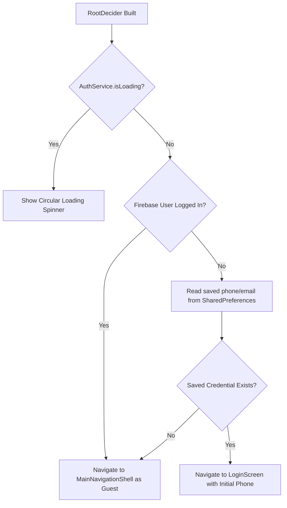
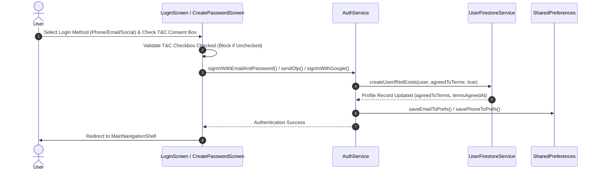
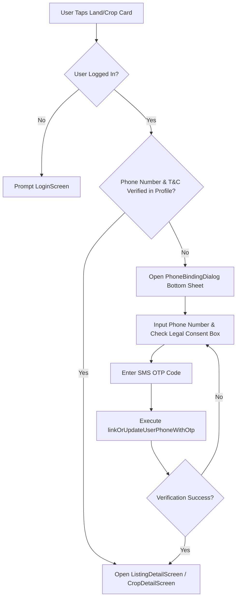
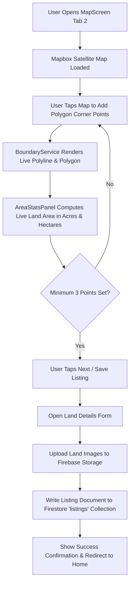
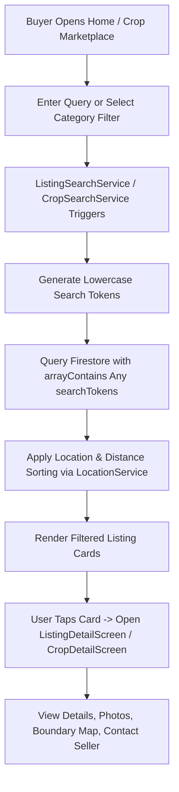

# AgroZemex - End-to-End Application & User Flow Specification

This document details the complete operational flow of the AgroZemex application for software engineers, product handovers, and AI assistants.

---

## 1. Application Startup & Initialization Flow

When the user launches AgroZemex, the app executes a non-blocking initialization sequence to ensure fast startup times without ANR (Application Not Responding) hangs.



---

## 2. Authentication & Root Routing Decision Flow

`RootDecider` evaluates the user state and directs them to either the main app shell or the authentication screen.



---

## 3. Main Navigation Shell & Protected Tab Flow

`MainNavigationShell` acts as the persistent container hosting 5 primary screens using an `IndexedStack` to preserve state across tab switches.

```
+-------------------------------------------------------------------+
|                        IndexedStack Body                          |
|                                                                   |
|  Tab 0: HomeScreen          (Land Marketplace - Guest Accessible) |
|  Tab 1: CropHomeScreen      (Crop Marketplace - Guest Accessible) |
|  Tab 2: MapScreen           (Map Boundary Drawing - Protected)   |
|  Tab 3: CropSellScreen      (Sell Crop Listing   - Protected)   |
|  Tab 4: ProfileScreenDash   (User Dashboard      - Protected)   |
|                                                                   |
+-------------------------------------------------------------------+
|                   CustomBottomNav (5 Tab Buttons)                 |
+-------------------------------------------------------------------+
```

### Tab Protection Logic (`_onTabSelected`)

- **Unauthenticated Users**:
  - Can freely view **Tab 0 (HomeScreen)** and **Tab 1 (CropHomeScreen)**.
  - Tapping **Tab 2 (Sell Land/Map)**, **Tab 3 (Sell Crop)**, or **Tab 4 (Profile)** triggers a SnackBar notice (`Please log in to [action]`) and opens `LoginScreen` via modal navigation push.
- **Authenticated Users**:
  - Seamlessly switch between all 5 tabs without losing scroll position or form data thanks to lazy-loaded `IndexedStack`.

---

## 4. User Journeys & Workflow Diagrams

### 4.1 Authentication & Legal Consent Workflow



### 4.2 Details Screen Access & Phone Binding Guard



---

### 4.2 Interactive GIS Land Boundary Drawing & Listing Creation Flow

The land seller draws a polygon boundary on Mapbox satellite imagery to automatically calculate land area in Acres/Hectares.



---

### 4.3 Land & Crop Marketplace Search & Discovery Flow



---

### 4.4 Wishlist & Seller Management Flow

- **Saving Listings**: Users tap the heart icon on any land or crop card to toggle items in their wishlist saved via `WishlistService` in Firestore.
- **Seller Dashboard (`SellerDashboard`)**: Sellers can view their posted listings, track status, edit details, or remove active listings.
- **Admin Control (`AdminPanel`)**: Administrative users can manage platform users, review flagged listings, and monitor platform metrics.
